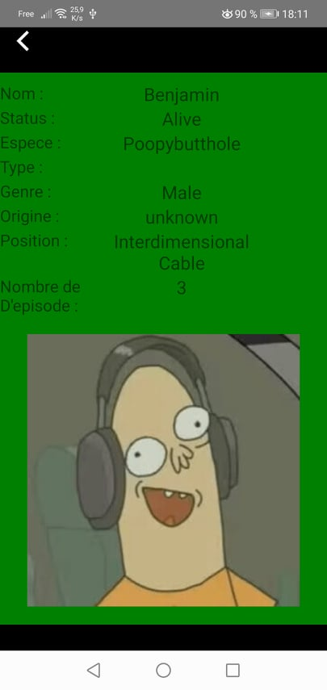

# Rick-and-Morty

Date du debut de projet : 20/11/2021

## Sujet :

Réalisation d’une application fan en Swift, Kotlin ou React Native de la série rick & morty

- Un écran d'accueil présentant les personnages de la série, scrollable
- Possibilité de les filtrer par genre et statut
- Au clic sur un personnage, affichage de son détail- API à utiliser (en graphql):[https://rickandmortyapi.com/documentation/#graphql](https://rickandmortyapi.com/documentation/#graphql)
- Gestion des environnements : avoir un (ou plusieurs) schema avec plusieurs configurations, pour au moins changer le nom de l'app et activer/désactiver les logs et les debug modes
- Se focaliser sur l'architecture de l'application et produire un code coverage d'au moins 60%

## Environnement disponible :

- Development : npm run dev_mode
- Production : npm run prod_mode

## Dépendance :

- react "17.0.2"
- react-native "0.66.3"
- react-native-rename
- @react-navigation/native "6.0.6"
- @react-navigation/native-stack "6.2.5"
- @apollo/client "3.4.17"
- graphql "15.7.2" 
- react-native-screens "3.9.0"
- react-native-safe-area-context "3.3.2"

## Appareil tester :

- Real Device Honor 10 (Android 10)
- Emulateur Iphone 12

## Screen

- Plateforme : Honor 10
- Date des screens : 24/11/2021

  

